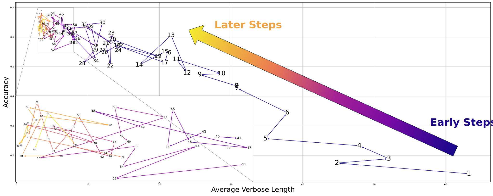

<div align='center'>
<h1>Beyond the Training Plateau: Verbose Length Reduction in Reinforcement Learning on LLMs
</h1>


[](https://dirtydan0.notion.site/Beyond-the-Training-Plateau-Verbose-Length-Reduction-in-Reinforcement-Learning-on-LLMs-1bdbfca801e180bfa63afba2dd28ba4c?pvs=4)
[](https://api.wandb.ai/links/dirtydan0/4qe871y8)    
</div>

This repository investigates the issue of verbose responses generated by large language models during reinforcement learning training. 

We define **verbose length** as the number of tokens following the answer enclosed in `\boxed{}`. 

Our analysis reveals that verbose length naturally decreases over training steps. These findings suggest an emergent ability of the model to reduce verbosity, even in the absence of explicit constraints and even when other training metrics have already plateaued. Moreover, responses containing Python code are initially more verbose but also become more concise over time.

<div align='center'>
  
  <figcaption>
    As accuracy improves, the average verbose length decreases.
  </figcaption>
  
  <figcaption>
    The proportion of responses with shorter verbose lengths increases progressively during training.
  </figcaption>
</div>


## Installation

```bash
conda create -n vlr python==3.10
conda activate vlr
pip3 install vllm==0.8.1 liger_kernel==0.5.8
# If the following step gets stuck, you can manually download the .whl file
# from https://github.com/Dao-AILab/flash-attention/releases/
# and install it with: pip3 install flash_attn-XXXX.whl
pip3 install flash-attn --no-build-isolation 
pip3 install -e .
```

## Training
We have already prepared [MATH](https://github.com/openai/prm800k/blob/main/prm800k/math_splits/train.jsonl) dataset in `data/math`.

As an example, to run `REINFORCE` training:

```bash
export MODEL_PATH=path_to_the_model
conda activate vlr
. scripts/reinforce.sh
```
During training, various data including responses, scores, and lengths will be recorded in a `.ndjson` file under `dump/`, which could be used for further analysis.

To save checkpoint, please set `trainer.save_freq`>0.

(Optional) To use wandb for logging, please export your wandb api key before training.
```bash
export WANDB_API_KEY=your_wandb_api_key
```
Then append `'wandb'` to `trainer.logger`.

## Acknowledge

We built this repository based on [verl](https://github.com/volcengine/verl) and chose [Qwen2.5-3B](https://qwenlm.github.io/zh/blog/qwen2.5/) as the base model.

## Citation
If this blog or code helped you, a citation would be greatly appreciated!


```
@misc{wu2025vlr,
  title        = {Beyond the Training Plateau: Verbose Length Reduction in Reinforcement Learning on LLMs},
  author       = {Wu, Lumeng},
  year         = {2025},
  howpublished = {\url{https://dirtydan0.notion.site/Beyond-the-Training-Plateau-Verbose-Length-Reduction-in-Reinforcement-Learning-on-LLMs-1bdbfca801e180bfa63afba2dd28ba4c?pvs=4}},
  note         = {Code: \url{https://github.com/dirtyDan0/VerboseLengthReduction}},
}
```


